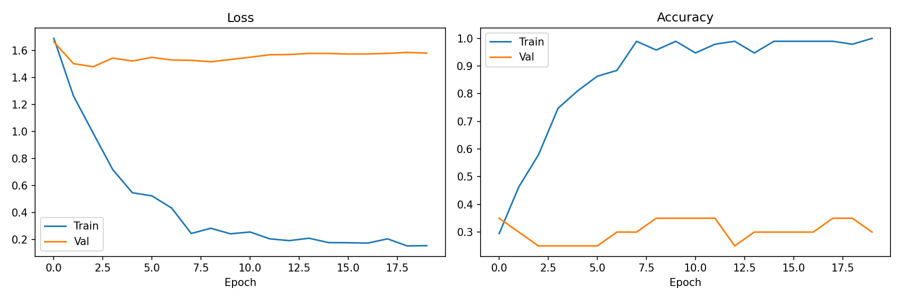
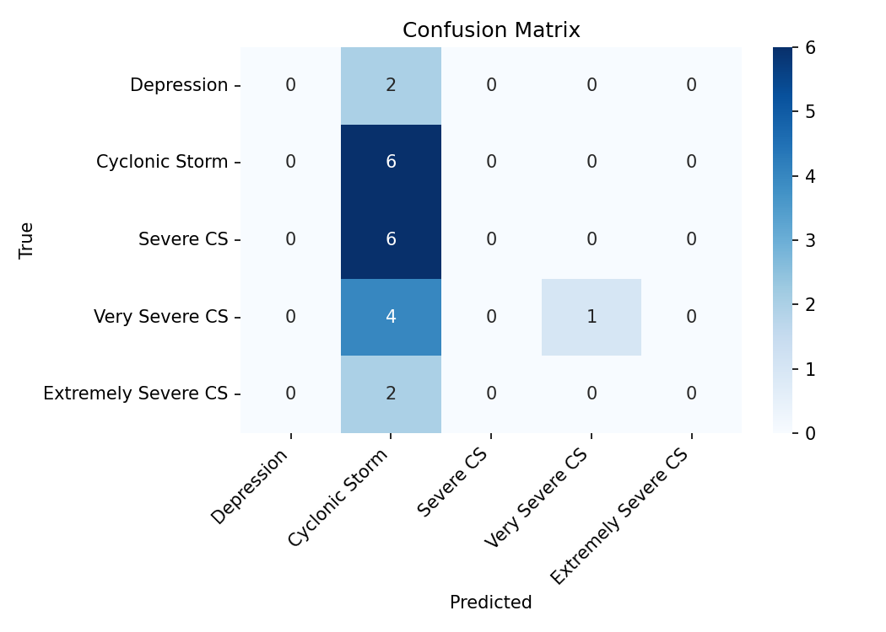
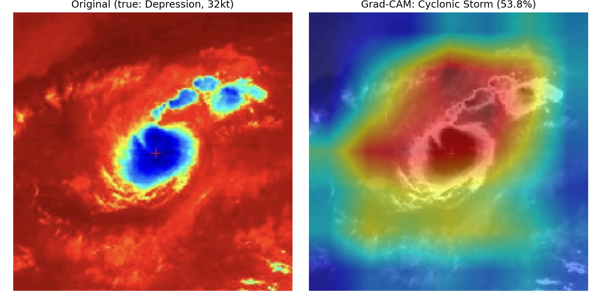
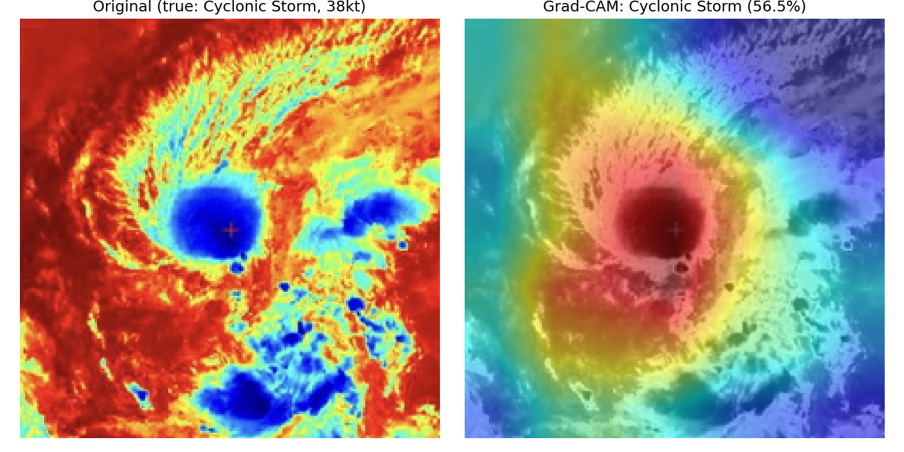
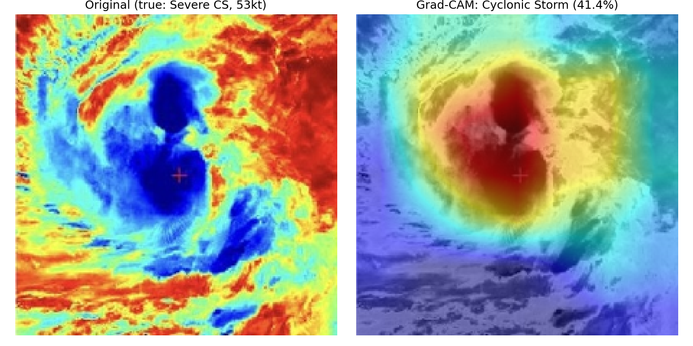
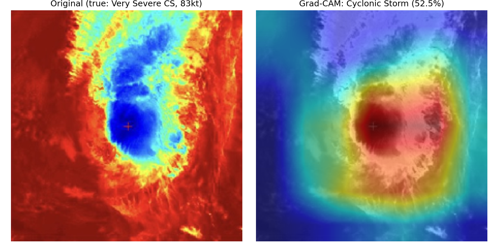
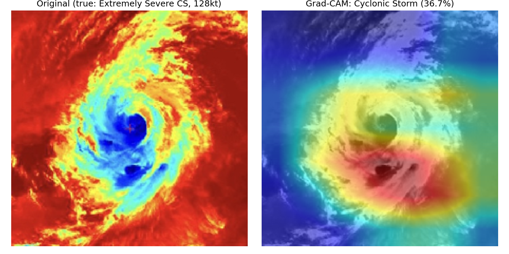

# Tropical Cyclone Intensity Classification from Satellite Imagery

CIA 3 Project — Computer Vision (Deep Learning-based approach)

## Overview

Tropical cyclone intensity has traditionally been estimated using the Dvorak technique — a manual process of reading satellite cloud patterns. This project explores a deep learning alternative: a ResNet18 model fine-tuned to classify cyclone intensity directly from a single infrared satellite image, into one of five IMD-standard intensity categories, with Grad-CAM used to visualize what the model focuses on when making each prediction.

**Pipeline:** Satellite image → ResNet18 (transfer learning) → intensity category → Grad-CAM explainability

## Dataset

- **Source:** [INSAT3D Infrared & Raw Cyclone Imagery (2013–2021)](https://www.kaggle.com/datasets/sshubam/insat3d-infrared-raw-cyclone-images-20132021) (Kaggle)
- **Size:** 418 infrared satellite images
- **Labels:** Wind speed (knots), from the dataset's official label CSV, bucketed into IMD intensity categories:

| Category | Wind Speed (knots) |
|---|---|
| Depression | < 34 |
| Cyclonic Storm | 34–47 |
| Severe Cyclonic Storm | 48–63 |
| Very Severe Cyclonic Storm | 64–89 |
| Extremely Severe Cyclonic Storm | 90+ |

## Method

- **Model:** ResNet18, pretrained on ImageNet, fine-tuned for 5-class classification
- **Class imbalance:** handled with inverse-frequency class-weighted loss
- **Data augmentation:** random rotation, horizontal flip, colour jitter (heavier than usual, given the small dataset)
- **Explainability:** Grad-CAM heatmaps generated for every prediction, overlaid on a grayscale version of the base image — IR satellite images are already jet/rainbow-colored, so overlaying a jet-colored heatmap directly on the original would wash it out

## Results

**Training curves:**



**Confusion matrix:**



- Test accuracy: ~29–48% across runs (small 21-image test set leads to real run-to-run variance)
- Misclassifications cluster near category boundaries (e.g. a 33kt storm predicted as the neighbouring 34kt+ class), which is expected given how close raw values sit to the IMD scale's cutoffs
- **Known limitation:** 418 images across 5 classes is a small dataset for deep learning; this is discussed as an explicit limitation in the accompanying literature review

**Grad-CAM — where the model focuses:**

| Depression | Cyclonic Storm | Severe CS |
|---|---|---|
|  |  |  |

| Very Severe CS | Extremely Severe CS |
|---|---|
|  |  |

For higher-intensity storms in particular, the heatmap consistently concentrates on the cyclone's eye/core region — consistent with what meteorological theory says should matter for intensity classification.

## Why Google Colab

Training used a Google Colab T4 GPU for practical training times — CNN training on CPU alone is significantly slower. The notebook in `notebooks/` captures that original run's full output (training log, confusion matrix, Grad-CAM images). The pipeline was also verified to run end-to-end locally on CPU (see `src/`), so it works with or without a GPU.

## Project Structure

```
cyclone-intensity-classification/
├── src/                      # pipeline code
│   ├── config.py             # shared paths, classes, hyperparameters
│   ├── download_data.py      # downloads the dataset from Kaggle
│   ├── dataset.py            # labeled dataframe + PyTorch Dataset
│   ├── model.py              # ResNet18 model definition
│   ├── train.py              # training loop -> best_model.pth
│   ├── evaluate.py           # test-set evaluation -> confusion matrix
│   └── gradcam.py            # Grad-CAM visualizations
├── notebooks/
│   └── Cyclone_Intensity_Classification_v2.ipynb   # original Colab run
├── results/                  # output images (shown above)
├── requirements.txt
├── .gitignore
└── README.md
```

## How to Run

```bash
pip install -r requirements.txt
cd src

# 1. Kaggle API token at ~/.kaggle/kaggle.json
#    (get one: kaggle.com/settings -> API -> Create New Token)

python download_data.py   # downloads dataset to ../data/
python train.py           # trains model -> best_model.pth, ../results/training_curves.png
python evaluate.py        # evaluates -> ../results/confusion_matrix.png
python gradcam.py         # generates ../results/gradcam_*.png
```

Tested working on both GPU (Colab T4) and CPU (local, no GPU) — CPU is just slower.

## Author

Umma Jubaiya — B.Tech CSE (AI & ML), CHRIST (Deemed to be University), Bengaluru
